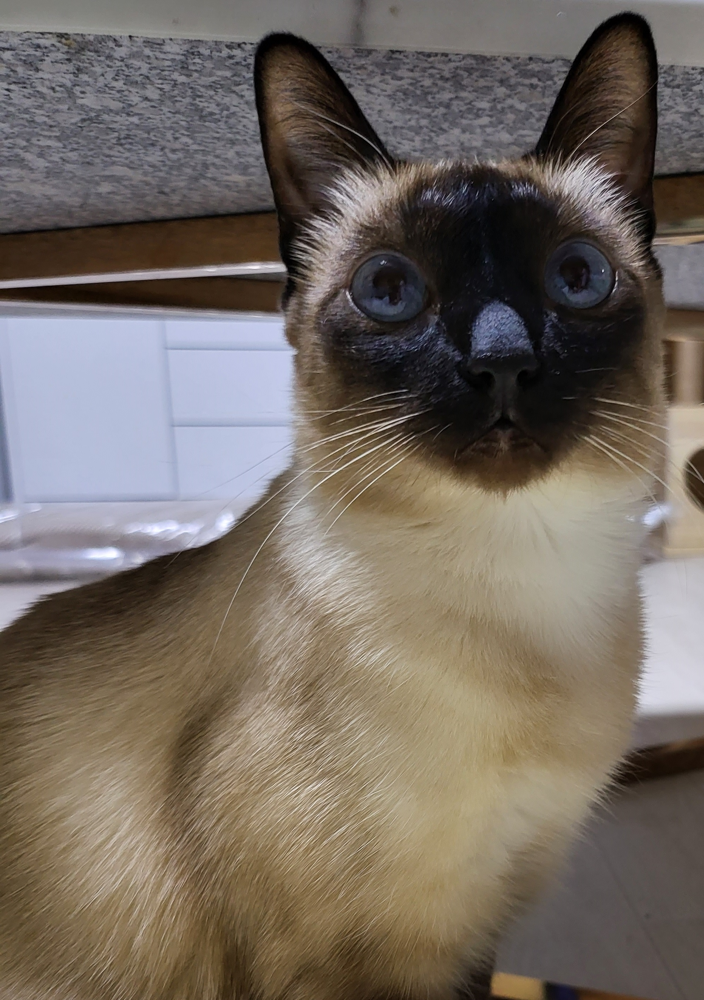

# 빙수봇

>  
>
> (빙수, 샴, 2019년생)

간단한 게임, 음악 재생, 자유주제 채팅 기능을 가진 디스코드 챗봇

RPI 4를 통해 서비스 중

### To do
- 자유 주제 채팅 기능 고도화
- 문체 변환 기능( `~~요` -> `~~다냥` )
    - nmt기반 모델 고려
- 챗봇 채팅 결과, 게임 기록, 음악 정보 등 DB에 저장
- 현재 서버가 rpi 4, tensorflow 2.4.0기반으로 동작하므로 호환성 고려 필요

python 3.7.2